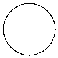
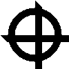

# canvas-drawer

Implements a simple drawing api

TODO: Add a representative image for your project here

## How to build

*Windows*

Open git bash to the directory containing this repository.

```
canvas-drawer $ mkdir build
canvas-drawer $ cd build
canvas-drawer/build $ cmake -G "Visual Studio 16 2019" ..
canvas-drawer/build $ start Draw-2D.sln
```

Your solution file should contain two projects: `pixmap_art` and `pixmap_test`.
To run from the git bash command shell, 

```
canvas-drawer/build $ ../bin/Debug/draw_test
canvas-drawer/build $ ../bin/Debug/draw_art
```

*macOS*

Open terminal to the directory containing this repository.

```
canvas-drawer $ mkdir build
canvas-drawer $ cd build
canvas-drawer/build $ cmake ..
canvas-drawer/build $ make
```

To run each program from build, you would type

```
canvas-drawer/build $ ../bin/draw_test
canvas-drawer/build $ ../bin/draw_art
```

## Supported primitives
```c++
// draw a circle with given center (x, y) and radius
void draw_circle(int x, int y, int radius);
```


```c++
// draw a rectangel with given center (x, y), width, and height
void draw_rectangle(int x, int y, int width, int height);
```


```c++
// set the width of shape borders
void set_width(int width);
```


```c++
// Resemble dotted lines by randomly missing some pixels, and expect
// to only draw *ratio* amount of pixels in total
void dotted(float ratio);
```


## Result

*The Deathly Hallows* from *Harry Potter*


